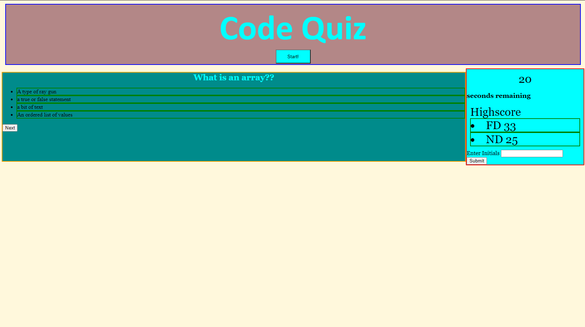

# Code Quiz

## Discription
This is a Code Quiz, it has basic coding questions for practice interview scenerios.

###
* When you get to the page, a start button will start the quiz
* The timer will start and a question will appear
* when you hit the next button another question will appear
* if an answer is inccorrect time will be taken from the timer 
* if all questions have been asked and there is still time remaining
* you can enter a high score
* if you run out of time and alert message will dispay asking to try again 

## Deployed Page
https://nandodavila.github.io/Code-Quiz/

